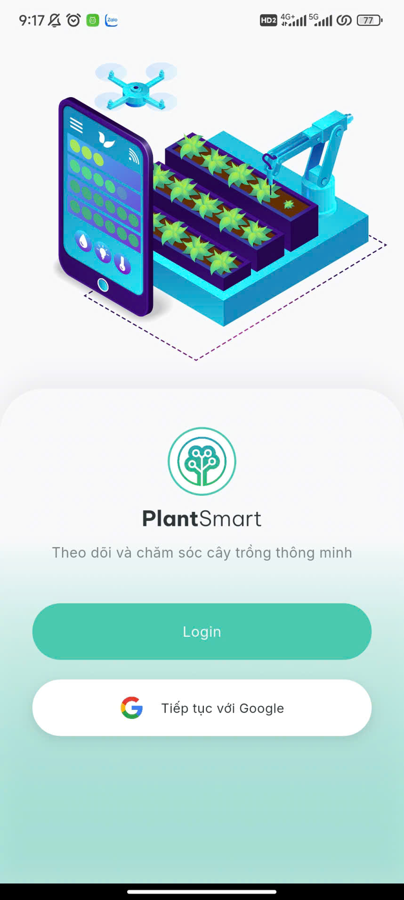
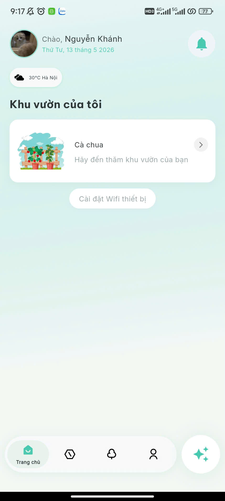
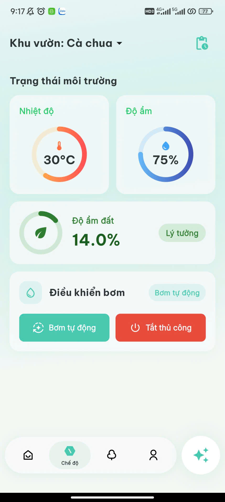
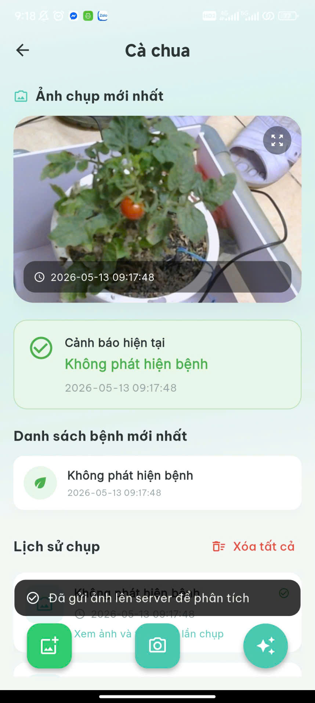
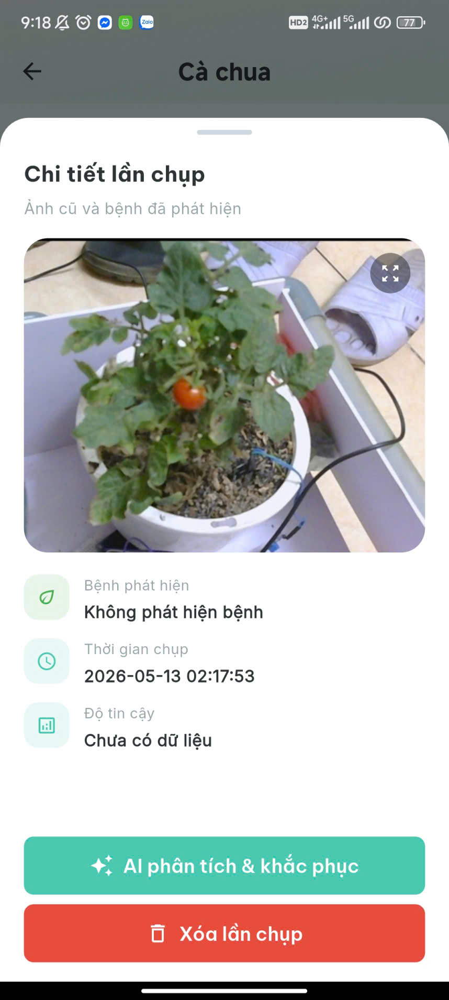
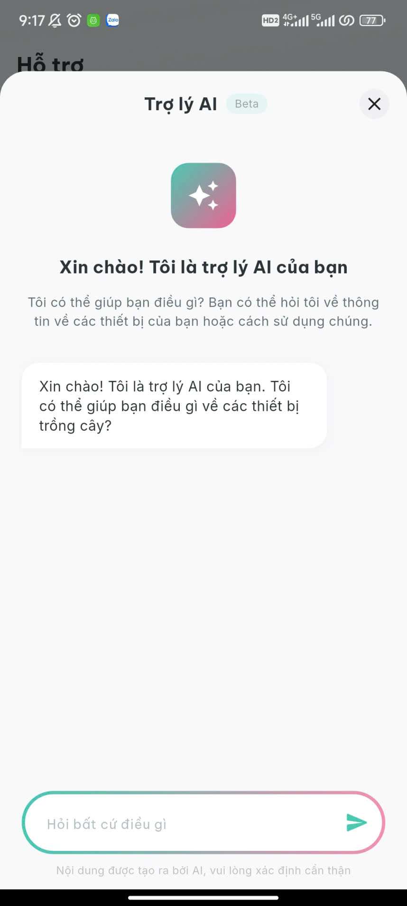
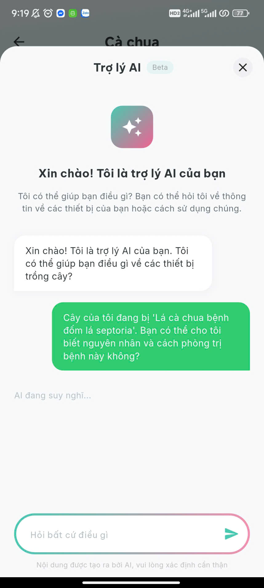
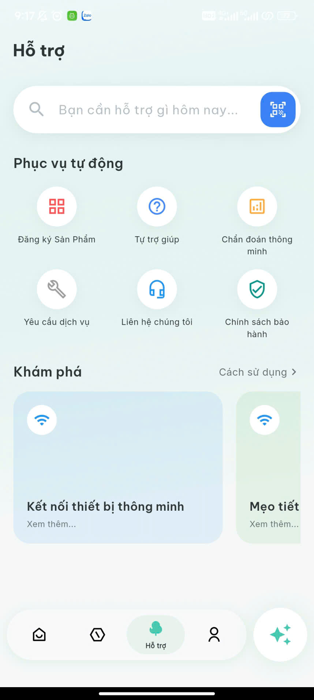
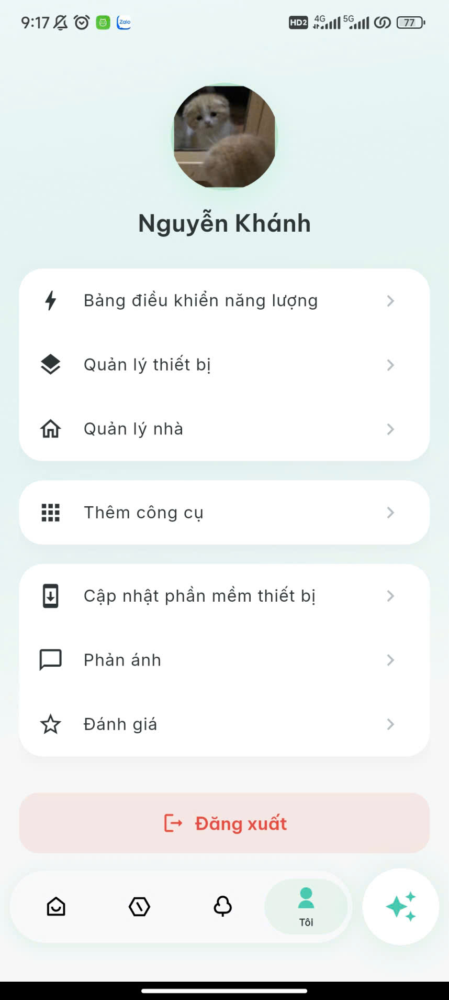
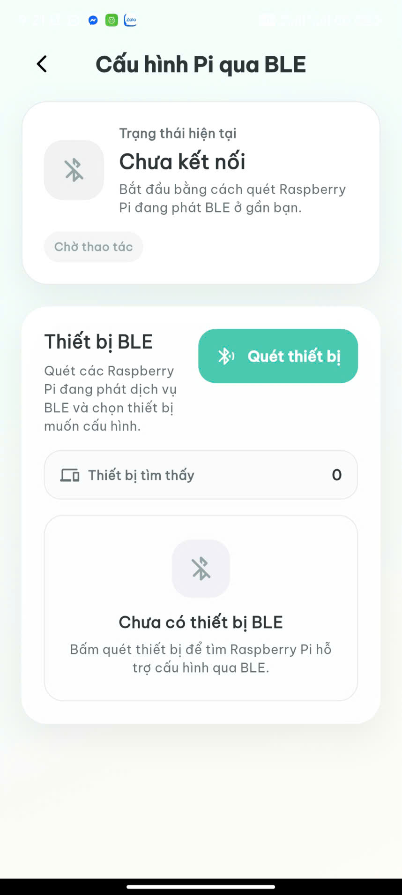

# 🌿 Plant Smart - IoT Plant Doctor (Flutter App)

**Plant Smart** là ứng dụng di động đóng vai trò là trung tâm điều khiển và giám sát cho hệ thống IoT nông nghiệp thông minh. Ứng dụng cho phép người dùng theo dõi tình trạng môi trường, điều khiển thiết bị tưới tiêu tự động và nhận cảnh báo sớm về các loại bệnh trên cây trồng thông qua tích hợp AI.

## 🧾 Báo cáo dự án (Project Report)

### ✅ Mục tiêu
* Xây dựng ứng dụng giám sát và điều khiển vườn cây thông minh trên nền tảng di động.
* Hiển thị dữ liệu cảm biến, trạng thái thiết bị và lịch sử hoạt động theo thời gian thực.
* Hỗ trợ phát hiện sớm bệnh cây và cung cấp cảnh báo/khuyến nghị chăm sóc.
* Đảm bảo giao diện thân thiện, dễ sử dụng cho người dùng phổ thông.

---

## 📱 Các tính năng chính (Key Features)

* 🔐 **Đăng nhập & hồ sơ:** Xác thực Google và quản lý thông tin người dùng.
* 🏡 **Trang chủ khu vườn:** Tổng quan khu vườn, cây trồng và trạng thái hiện tại.
* 🌡 **Giám sát môi trường:** Nhiệt độ, độ ẩm không khí, độ ẩm đất cập nhật realtime.
* 💧 **Điều khiển thiết bị:** Bật/tắt bơm thủ công hoặc tự động theo ngưỡng/lịch trình.
* 🧪 **Chẩn đoán bệnh cây:** Ảnh chụp, lịch sử lần chụp, kết quả phân tích và cảnh báo.
* 📡 **Cấu hình thiết bị:** Ghép nối và cấu hình Raspberry Pi qua BLE.
* 💬 **Hỗ trợ người dùng:** Trung tâm hỗ trợ và trợ lý AI tư vấn.

## 🖼 Hình ảnh các màn hình (Screenshots)

| Màn hình | Ảnh |
| --- | --- |
| Đăng nhập |  |
| Trang chủ khu vườn |  |
| Chế độ & điều khiển bơm |  |
| Chẩn đoán bệnh (tổng quan) |  |
| Chi tiết lần chụp |  |
| Trợ lý AI (mở) |  |
| Trợ lý AI (hội thoại) |  |
| Trung tâm hỗ trợ |  |
| Hồ sơ người dùng |  |
| Cấu hình Pi qua BLE |  |

---

## 🛠 Công nghệ & Thư viện sử dụng (Tech Stack)

Dự án chú trọng áp dụng các best practices của hệ sinh thái Flutter:

* **Framework:** Flutter (Dart)
* **Architecture:** Tách biệt rõ ràng theo chuẩn **Clean Architecture** (Domain, Data, Presentation).
* **State Management:** **Riverpod** (`riverpod_annotation`, `flutter_riverpod`) xử lý reactive state tối ưu.
* **Routing:** **GoRouter** quản lý điều hướng và deep linking.
* **Networking & API:** `Dio` thao tác REST API (thời tiết) và Firebase SDK.
* **Data Modeling:** `Freezed` & `JsonSerializable` tạo immutable state và parse JSON an toàn.
* **UI/UX:**
  * `flutter_screenutil` - Responsive UI mọi kích thước màn hình.
  * `fl_chart` - Vẽ biểu đồ dữ liệu môi trường.
  * `lottie` & `flutter_svg` - Animation và icon vector.
* **Firebase Suite:** Khai thác toàn diện hệ sinh thái Firebase (Auth, Firestore, Storage, Messaging, Crashlytics, Analytics, Remote Config, Performance).

